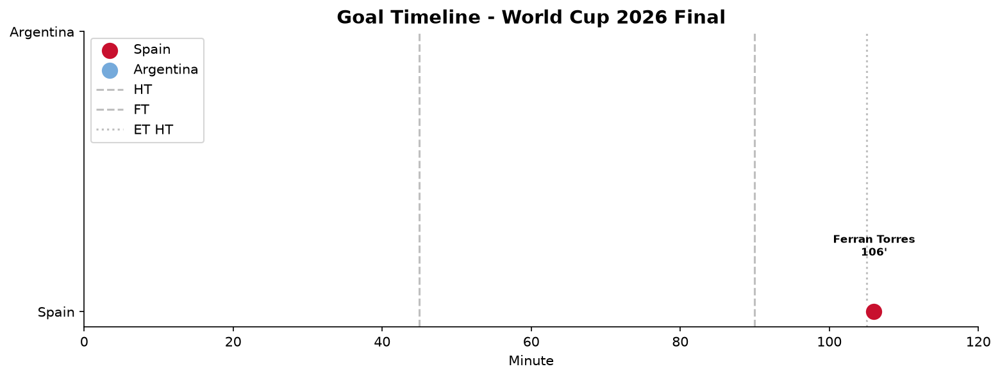
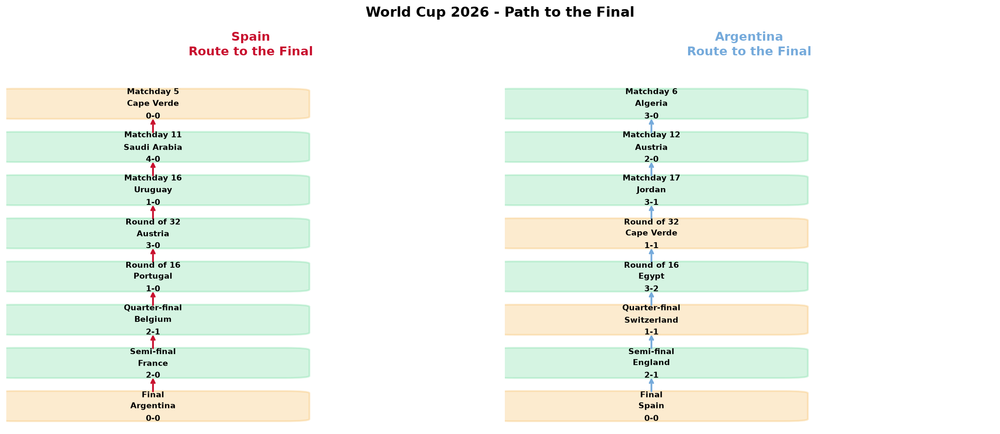
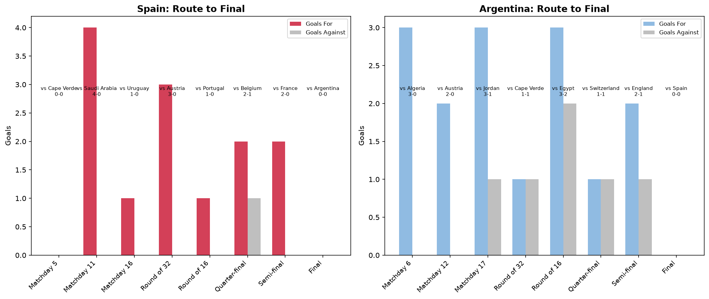
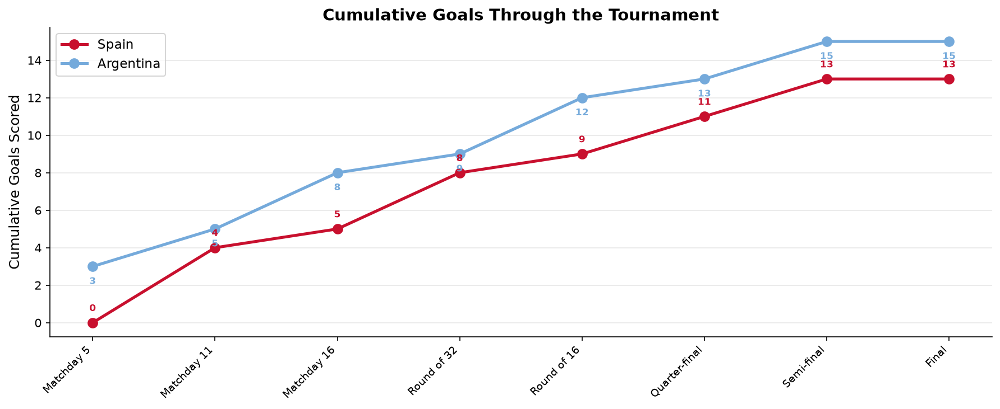
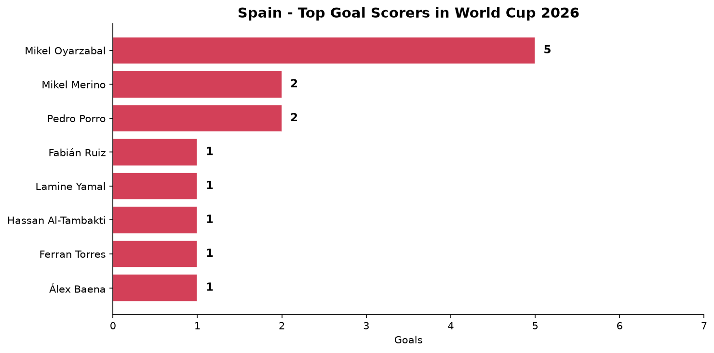
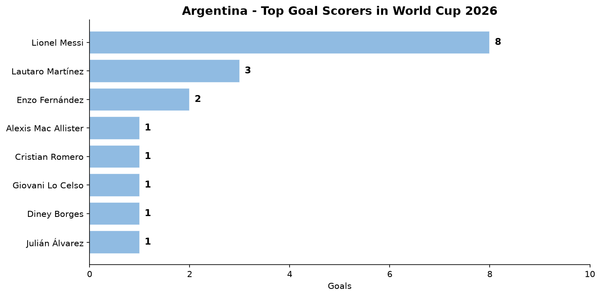
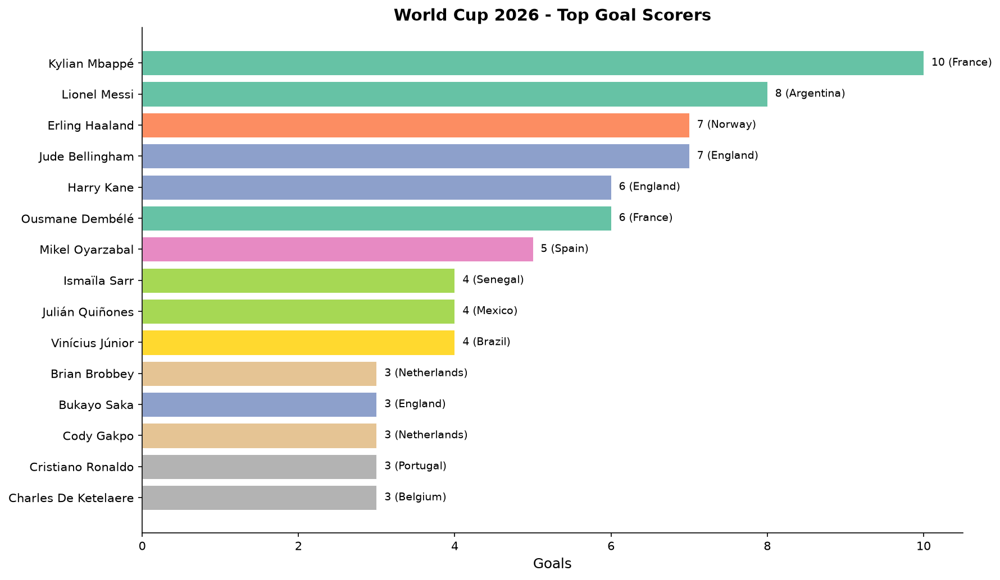
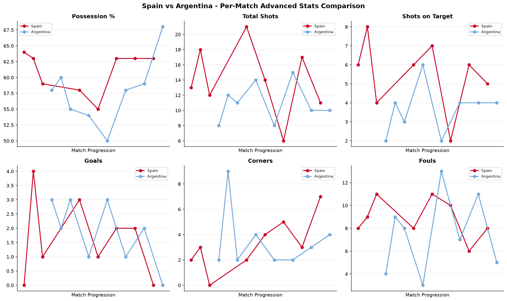
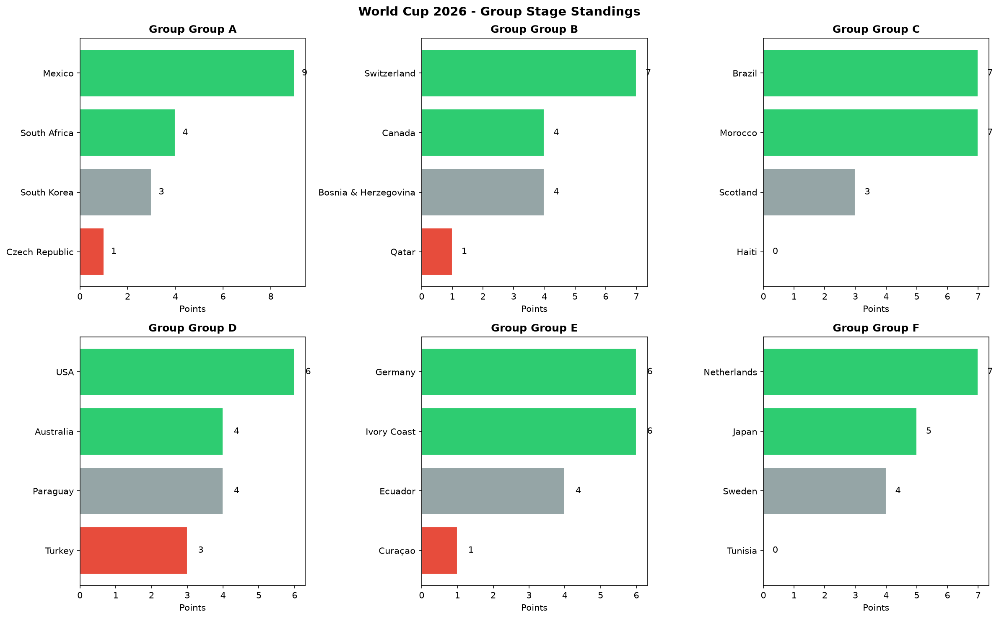

# ⚽ World Cup 2026 Final Analysis

Análisis de datos completo del Mundial de Fútbol 2026, con enfoque en la final entre **España** y **Argentina** y el recorrido de ambos equipos hacia el título.

**Resultado**: España 1 – 0 Argentina (t.e.) | Gol: **Ferran Torres** 106' | MetLife Stadium, East Rutherford

---

## 1. La Final: Gol en la Prórroga

El partido decisivo se mantuvo 0-0 durante 90 minutos. Ferran Torres, que no había marcado en todo el torneo, apareció en el minuto 106 para darle el segundo título mundial a España.



> **Dato clave:** España no recibió **ni un solo tiro a puerta** en los 120 minutos. Argentina terminó con 10 hombres por expulsión de Enzo Fernández.

---

## 2. El Camino a la Final

Ambos equipos llegaron invictos, pero con estilos muy distintos. España basó su éxito en una defensa sólida (1 solo gol recibido en todo el torneo), mientras Argentina apostó por su potencia ofensiva.




| Ronda | España (vs) | Resultado | Argentina (vs) | Resultado |
|-------|-------------|-----------|----------------|-----------|
| Grupo | Cape Verde | 0-0 | Algeria | 3-0 |
| Grupo | Saudi Arabia | 4-0 | Austria | 2-0 |
| Grupo | Uruguay | 1-0 | Jordan | 3-1 |
| 1/32 | Austria | 3-0 | Cape Verde | 1-1 (3-2 pen) |
| 1/16 | Portugal | 1-0 | Egypt | 3-2 |
| 1/4 | Belgium | 2-1 | Switzerland | 1-1 (3-1 pen) |
| 1/2 | France | 2-0 | England | 2-1 |
| Final | Argentina | 1-0 | España | 0-1 |



---

## 3. Los Goleadores

### 🇪🇸 España

Mikel Oyarzabal fue el máximo artillero español con 5 goles, seguido de Mikel Merino y Pedro Porro con 2 cada uno.



### 🇦🇷 Argentina

Lionel Messi, en su último Mundial, dominó la tabla de goleadores argentina con 8 goles, seguido por Lautaro Martínez (3) y Enzo Fernández (2).



### 🏆 Torneo

| Jugador | País | Goles |
|---------|------|-------|
| Kylian Mbappé | Francia | 10 |
| Lionel Messi | Argentina | 8 |
| Erling Haaland | Noruega | 7 |
| Jude Bellingham | Inglaterra | 7 |
| Harry Kane | Inglaterra | 6 |



---

## 4. Estadísticas Avanzadas (Datos Reales — Fox Sports)

Las estadísticas por partido se obtuvieron scrapeando **Fox Sports** desde su API interna (`bifrost/v1`). Se recolectaron **17 categorías** de estadísticas avanzadas para los **104 partidos** del torneo, incluyendo posesión, tiros, xG, córners, faltas, tacles, pases, etc.

Para España y Argentina, el **100% de los datos** provienen de Fox Sports (16 registros: 8 partidos cada uno, 0 sintéticos).



| Estadística | España (promedio real) | Argentina (promedio real) |
|------------|----------------------|-------------------------|
| Posesión | 62% | 55% |
| Tiros totales | 14.5 | 10.0 |
| Tiros al arco | 6.4 | 3.6 |
| xG | 1.60 | 1.19 |
| Pases precisos | 90% | 85% |
| Córners | 5.4 | 3.9 |
| Faltas | 11.5 | 13.6 |
| Tacles | 10.1 | 12.0 |

> **Nota:** Además de los promedios por equipo, se extrajeron también estadísticas generales del torneo (líderes por categoría) desde la página de estadísticas de Fox Sports: España lidera en posesión (64%), córners (54) y vallas invictas (7); Argentina lidera en tacles (93).

---

## 5. Fase de Grupos

Ambos equipos dominaron sus grupos. España finalizó con 7 puntos (2V 1E) en el Grupo E, mientras Argentina fue perfecta con 9 puntos (3V 0E) en el Grupo F.



---

## 6. Conclusiones

- **España** demostró una solidez defensiva histórica: solo **1 gol recibido** en 8 partidos, estableciendo un récord en la era moderna de los Mundiales.
- **Argentina**, campeona defensora, plantó cara durante 105 minutos, pero la expulsión de Enzo Fernández y el cansancio acumulado terminaron pesando.
- **Ferran Torres**, sin goles en todo el torneo, se convirtió en héroe nacional con un golazo que recuerda al de Iniesta en 2010.
- **Lionel Messi** (39 años) disputó su último Mundial, cerrando con 8 goles — segundo máximo goleador del torneo detrás de Mbappé.
- España completa un histórico **doblete Eurocopa-Mundial** (Euro 2024 + Mundial 2026), el 4° equipo en lograrlo.

---

## Estructura del Proyecto

```
├── config.yaml              # Configuración del proyecto
├── requirements.txt         # Dependencias
├── data/
│   ├── raw/                 # Datos crudos de APIs
│   ├── processed/           # CSVs limpios
│   └── external/            # Datos scrapeados (Fox Sports)
├── src/
│   ├── pipeline.py          # Orquestador
│   ├── openfootball_client  # Cliente openfootball
│   ├── wcup_client          # Cliente wcup2026
│   ├── clean.py             # Limpieza
│   ├── analyze.py           # Métricas y análisis
│   ├── fox_sports_client.py # Scraper de Fox Sports (estadísticas por partido + líderes)
│   ├── visualize.py         # Visualizaciones
│   └── report.py            # Generación de informes
├── notebooks/               # Jupyter notebooks
├── reports/figures/         # Imágenes generadas
└── tests/
```

## Uso

```bash
pip install -r requirements.txt
python -m src.pipeline
```

---

## Fuentes de Datos

| Fuente | Descripción |
|--------|-------------|
| [openfootball/worldcup.json](https://github.com/openfootball/worldcup.json) | Resultados, goleadores y sedes |
| [wcup2026.org](https://wcup2026.org/api/data.php) | Partidos y clasificaciones |
| [Fox Sports](https://www.foxsports.com/soccer/2026-fifa-world-cup/stats) | Estadísticas avanzadas por partido (104 partidos, 17 categorías) y líderes del torneo |
